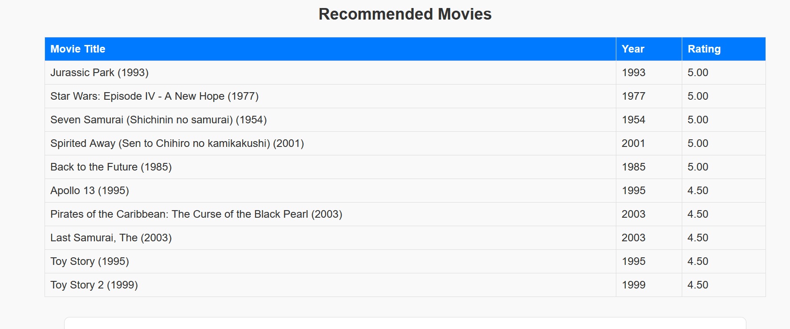
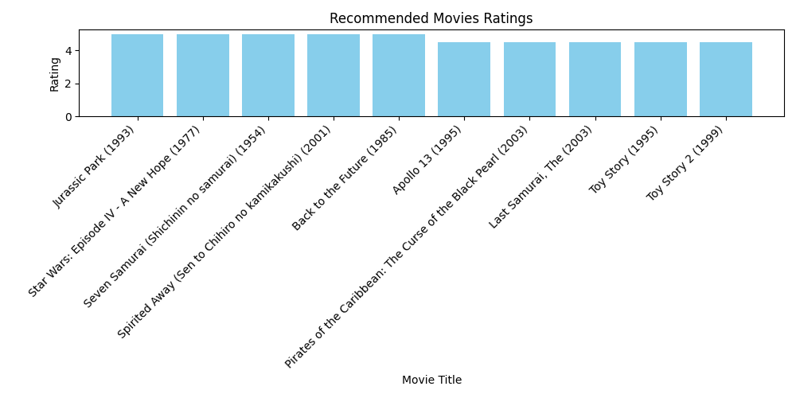

Movie Recommender System
Project Overview

This project is a simple Movie Recommender System built using Python and Flask. It uses the MovieLens (ml-latest-small) dataset to recommend movies to users based on their preferences such as genre, minimum rating, and release year range. The recommendation logic is implemented using collaborative filtering and filtering based on user inputs.
Features

Load and process MovieLens dataset (movies.csv and ratings.csv).

Extract movie release year from the title.

Filter movies by genre, rating, and year range.

    
Display recommendations in a user-friendly HTML page.

Generate and display a bar chart visualization of recommended movie ratings using Matplotlib.

Responsive and clean UI built with HTML and CSS.

Backend implemented using Flask for easy deployment and interaction.

How It Works

User visits the web page and inputs:

User ID

Preferred genre

Minimum rating threshold

Release year range (From - To)

The backend filters movies based on the selected genre and year range, then filters ratings by the minimum rating.

The system checks if the user has rated any movies matching the criteria:

If yes, it recommends the top rated movies by that user.

If no, it recommends the top rated movies overall within the filtered criteria.

A bar chart of recommended movie ratings is generated and shown on the page.

